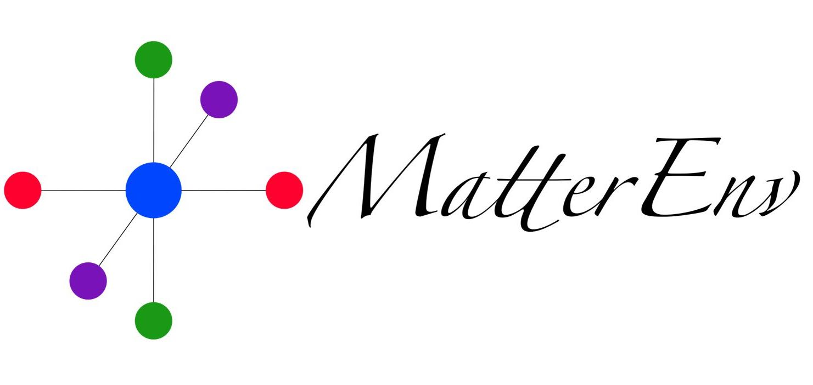

---

MatterEnv is an atomic environment package embedded in [Julia](https://julialang.org/).

**Latest Release**:
  * Installation via the Julia package manager:
    * `import Pkg; Pkg.add("MatterEnv")`
  * Documentation:
    * 
  * Testing status:
    * Github Actions: 
    * Test coverage: 
  * 
  * 
