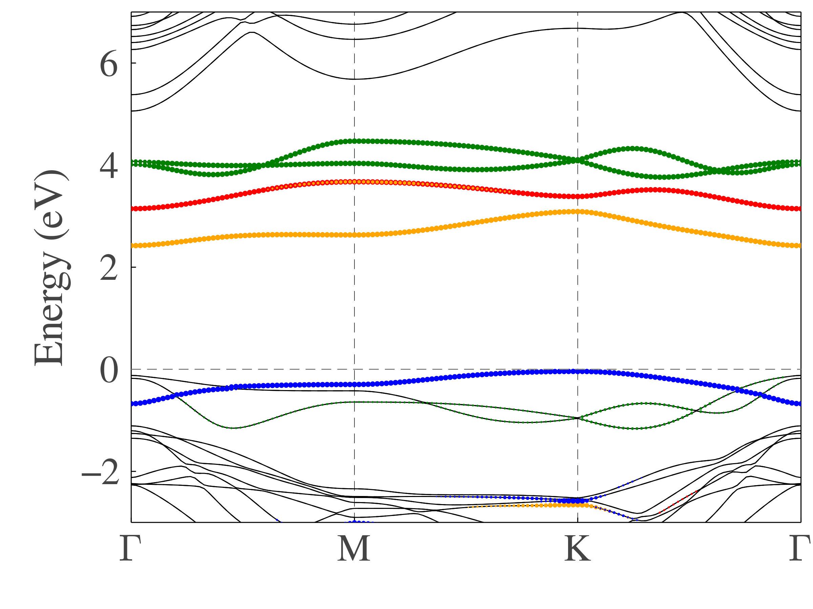

# [Projected Band Structure](@id BandTutorial)

Here, we will show how to plot projected band structure using PROCAR, as our first example.

To complete this task, we need three packages.
```julia
using MatterEnv
using Plots
using LaTeXStrings
```

The first step is to load metadata from PROCAR file, you can check the details from this [section](@ref PROCARManual).
Here, we use a GGA+U+SOC result with `lorbit=12` tag.
```julia
projection_all, _, _, projection_z, kpoints, bands = load_procar("PROCAR"; noncollinear=true)
```

To make the image look better, we set Fermi energy to be 0.
```julia
fermi_energy =  -3.0009
shift_energy!(bands, -fermi_energy)
```

Then we define two transformation matrix to do orbit transformation. You chan check the details from this [section](@ref OrbitManual)
```julia
transformation_matrix1 =
[
    -1/√3   √2/√3   0       0       0;
    √2/√3   1/√3    0       0       0;
    0       0       1       0       0;
    0       0       0       √2/√3   1/√3;
    0       0       0       -1/√3   √2/√3;
]
transformation_matrix2 =
[
    1       0       0       0       0;
    0       1/√2    0       0       1/√2im;
    0       0       1       0       0;
    0       0       0       1       0;
    0       1/√2    0       0       -1/√2im;
]
projection_transformation!(projection_all, transformation_matrix1, transformation_matrix2)
```

Since VASP doesn't distinguish between major spin and minor spin, we use a [trick](@ref TrickManual).
```julia
projection, bands = distinguish_spin(projection_all, projection_z, bands)
```

Finally, we can plot the projected band structure. Since Plots doesn't provide attribute to control ticks' length,
we use a [function](https://discourse.julialang.org/t/tick-size-in-plots-jl/74793/4) to solve this problem.

```julia
critical_points = ["Γ", "M", "K", "Γ"]      # Critical points of chosen k points
tolerance = 0.15                            # minimum value of projection character value to be plotted
magnify = 7.0                               # marker_size = magnify * projection_character
max_size = 3.0                              # maximum value of marker size

function ticks_length!(;tl=0.02)
    p = Plots.current()
    xticks, yticks = Plots.xticks(p)[1][1], Plots.yticks(p)[1][1]
    xl, yl = Plots.xlims(p), Plots.ylims(p)
    x1, y1 = zero(yticks) .+ xl[1], zero(xticks) .+ yl[1]
    sz = p.attr[:size]
    r = sz[1]/sz[2]
    dx, dy = tl*(xl[2] - xl[1]), tl*r*(yl[2] - yl[1])
    plot!([xticks xticks]', [y1 y1 .+ dy]', c=:black, labels=false)
    plot!([x1 x1 .+ dx]', [yticks yticks]', c=:black, labels=false, xlims=xl, ylims=yl)
    return Plots.current()
end

# some basic setting for the figure
plot(
    dpi = 300,
    size = (800, 600),
    framestyle = :box,
    fontfamily = "Times Roman",
    ylabel = "Energy (eV)",
    guidefontsize = 25,
    ylim = (-3.0, 7.0),
    legend = false,
    grid = :x,
    gridstyle = :dash,
    gridalpha = 1,
    tick_direction = :in,
    yticks = -2:2:6,
    yminorticks = false,
    tickfontsize = 23,
    bottom_margin = 1.0Plots.cm,
    left_margin = 1.0Plots.cm,
)

ticks_length!(;tl=0.02)

# plot all bands. black solid for spin up and gray dash line for spin down
plot!(bands, kpoints; critical_points = critical_points, colorlist = [:black, :black], stylelist = [:solid, :dash])

# plot projected band structure
plot!(projection, kpoints, bands; ion=1, orbit=7, markeralpha =1, markerstrokecolor=:red, markercolor=:red,  tolerance=tolerance, max_size=max_size, magnify=magnify)
plot!(projection, kpoints, bands; ion=1, orbit=6, markeralpha =1, markerstrokecolor=:orange, markercolor=:orange, tolerance=tolerance, max_size=max_size, magnify=magnify)
plot!(projection, kpoints, bands; ion=1, orbit=9, markeralpha =1, markerstrokecolor=:blue, markercolor=:blue, tolerance=tolerance, max_size=max_size, magnify=magnify)
plot!(projection, kpoints, bands; ion=1, orbit=5, markeralpha =1, markerstrokecolor=:green, markercolor=:green, tolerance=tolerance, max_size=max_size, magnify=magnify)
plot!(projection, kpoints, bands; ion=1, orbit=8, markeralpha =1, markerstrokecolor=:green, markercolor=:green, tolerance=tolerance, max_size=max_size, magnify=magnify)

# grid line
plot!([0, length(kpoints)], [0, 0], linecolor = :gray, linestyle = :dash, label=nothing)

savefig("band.png")

```



You can download this example script from [here](../assets/band.jl).