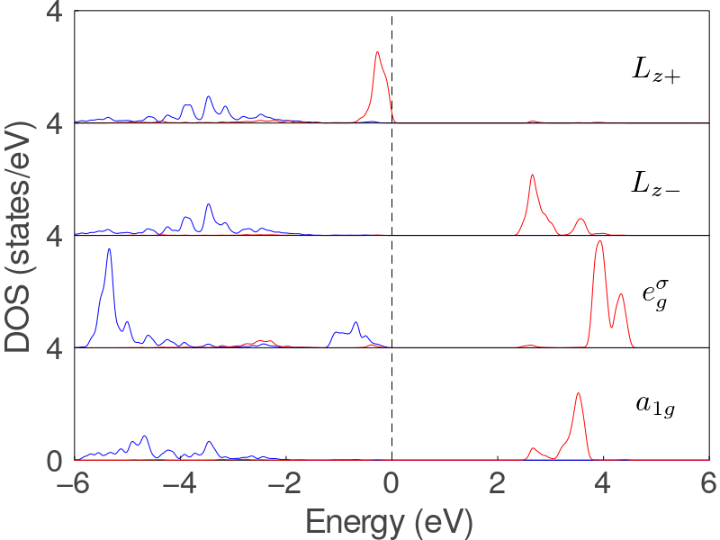

# [Projected DOS](@id DOSTutorial)

Here, we use a PROCAR with different k points distribution, and only modify the final step of last [tutorial](@ref BandTutorial) to
plot projected DOS.

In the last step, we generate projected DOS using Gaussian smearing method
```julia
smear(x, x₀) = gaussian(x, x₀; σ=0.05)
pdos_up_0, pdos_down_0 = generate_dos(bands, kpoints, projection; smear=smear, ions=[2], orbits=[2,3,4])
pdos_up_1, pdos_down_1 = generate_dos(bands, kpoints, projection; smear=smear, ions=[1], orbits=[7])
pdos_up_2, pdos_down_2 = generate_dos(bands, kpoints, projection; smear=smear, ions=[1], orbits=[5, 8])
pdos_up_3, pdos_down_3 = generate_dos(bands, kpoints, projection; smear=smear, ions=[1], orbits=[6])
pdos_up_4, pdos_down_4 = generate_dos(bands, kpoints, projection; smear=smear, ions=[1], orbits=[9])
```

and plot the projected DOS:
```julia
function ticks_length!(;tl=0.02)
    p = Plots.current()
    xticks, yticks = Plots.xticks(p)[1][1], Plots.yticks(p)[1][1]
    xl, yl = Plots.xlims(p), Plots.ylims(p)
    x1, y1 = zero(yticks) .+ xl[1], zero(xticks) .+ yl[1]
    sz = p.attr[:size]
    r = sz[1]/sz[2]
    dx, dy = tl*(xl[2] - xl[1]), tl*r*(yl[2] - yl[1])
    plot!([xticks xticks]', [y1 y1 .+ dy]', c=:black, labels=false)
    plot!([x1 x1 .+ dx]', [yticks yticks]', c=:black, labels=false, xlims=xl, ylims=yl)
    return Plots.current()
end

plot(
    dpi = 300,
    size = (800, 600),
    framestyle = :box,
    fontfamily = "Times Roman",
    ylabel = "DOS (states/eV)",
    xlabel = "Energy (eV)",
    guidefontsize = 25,
    ylim = (0, 20),
    xlim = (-6.0, 6.0),
    legend = false,
    yticks = (0:4:20, ["0", "2", "4", "4", "4", "4"]),
    grid = :y,
    gridstyle = :solid,
    tick_direction = :in,
    tickfontsize = 23,
    bottom_margin = 1.2Plots.cm,
    left_margin = 1.0Plots.cm,
)

ticks_length!(;tl=0.02)

# plot projected dos, blue line for spin up and red line for spin down
plot!(pdos_up_0; shift = 0, max = 2, stretch_ratio = 2, linecolor = :blue)
plot!(pdos_up_1; shift = 4, max = 4, linecolor = :blue)
plot!(pdos_up_2; shift = 8, max = 4, linecolor = :blue)
plot!(pdos_up_3; shift = 12, max = 4, linecolor = :blue)
plot!(pdos_up_4; shift = 16, max = 4,linecolor = :blue)
plot!(pdos_down_0; shift = 0, max = 2, stretch_ratio = 2,linecolor = :red)
plot!(pdos_down_1; shift = 4, max = 4, linecolor = :red)
plot!(pdos_down_2; shift = 8, max = 4, linecolor = :red)
plot!(pdos_down_3; shift = 12, max = 4, linecolor = :red)
plot!(pdos_down_4; shift = 16, max = 4, linecolor = :red)

# annotation
annotate!(5, 2, (L"3p", 23))
annotate!(5, 6, (L"a_{1g}", 23))
annotate!(5, 10, (L"e_{g}^{\sigma}", 23))
annotate!(5, 14, (L"L_{z-}", 23))
annotate!(5, 18, (L"L_{z+}", 23))

# grid line
plot!([-6, 6], [4, 4], linecolor = :black)
plot!([-6, 6], [8, 8], linecolor = :black)
plot!([-6, 6], [12, 12], linecolor = :black)
plot!([-6, 6], [16, 16], linecolor = :black)
plot!([0, 0], [0, 20], linecolor = :black, linestyle = :dash)

savefig("dos.png")
```

The result figure is plotted as


The script can be download from [here](../assets/dos.jl).